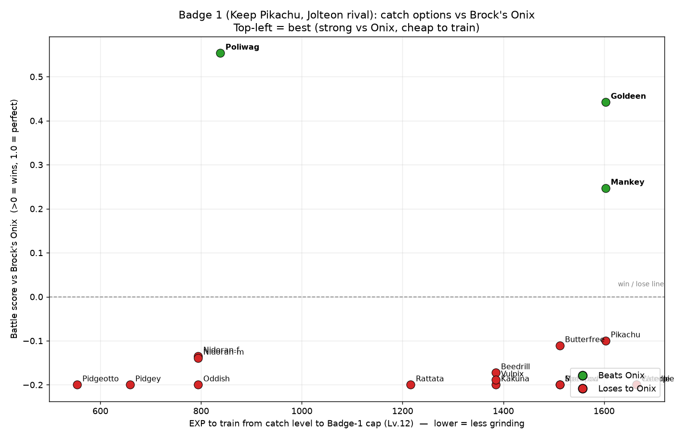
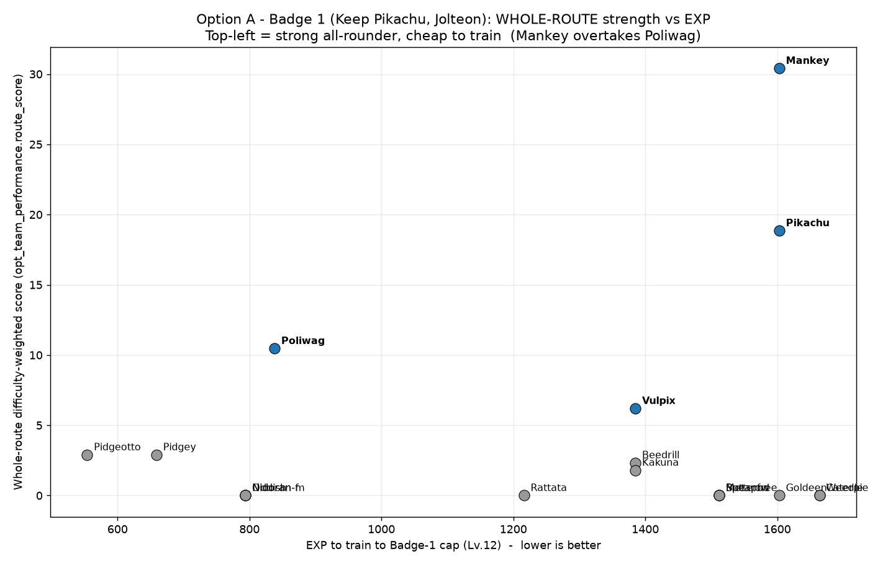
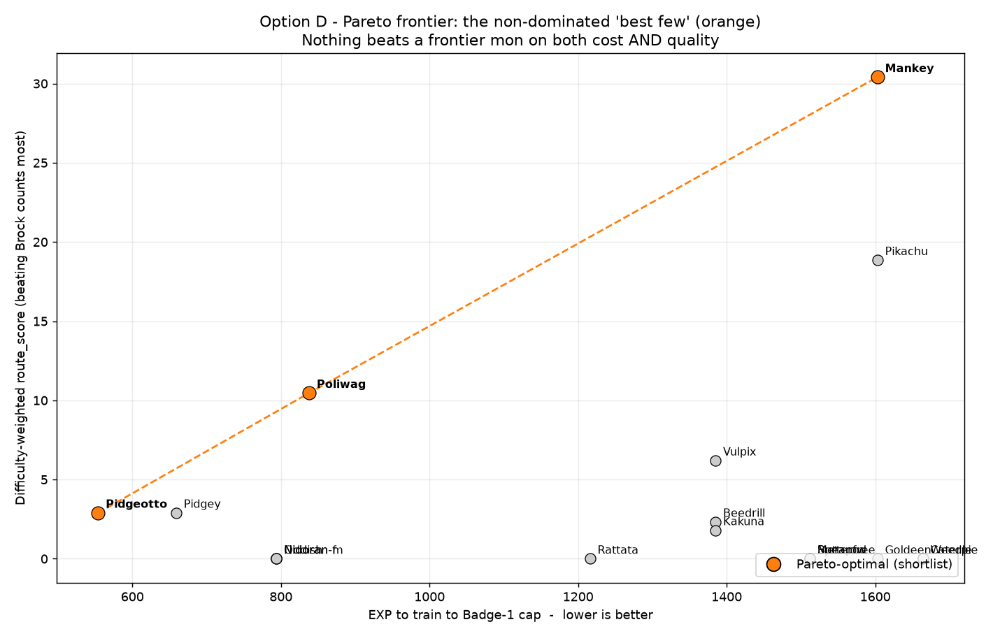

# Pokemon Yellow Legacy dbt

[](https://www.getdbt.com/)
[](https://duckdb.org/)
[](https://pokemon.com)

A **dbt** project analyzing Pokemon Yellow Legacy ROM hack data to find the best 6-pokemon team for every gym leader and all preceding trainers. The project uses DuckDB as the data warehouse and Generation 1 battle mechanics for damage calculations.

## Project Overview

This project transforms raw Pokemon game data into analytical models that answer: **What's the best team for beating Pokemon Yellow Legacy?**

Teams reset at each gym leader -- after defeating Brock, the entire team can change for the Misty segment. The project generates optimal teams across 12 run variants:

- **3 Rival types** -- Jolteon, Vaporeon, or Flareon
- **2 Pikachu options** -- Keep Pikachu (guaranteed team slot) or open competition
- **2 Legendary options** -- With or without legendary Pokemon

Key features:
- SQL-based optimization with deterministic results
- Generation 1 battle mechanics with exact damage calculations
- 12 run variants covering all meaningful playstyle combinations
- Greedy TM allocation with single-use conflict resolution
- Team coverage testing to identify uncoverable matchups

### What is Pokemon Yellow Legacy?

Pokemon Yellow Legacy is a ROM hack created by TheSmithPlays that aims to fix and polish the original Pokemon Yellow while staying true to Generation 1's vision.

<a href="https://youtu.be/9yxjuwCJbjI?feature=shared">
Watch: How to Play Pokemon Yellow Legacy
</a>

## Quick Start

### Prerequisites
- Python 3.8+
- dbt-duckdb adapter
- DuckDB

### Installation

1. **Clone the repository**
   ```bash
   git clone https://github.com/wjsutton/pkmn_yellow_legacy_dbt.git
   cd pkmn_yellow_legacy_dbt
   ```

2. **Install dependencies**
   ```bash
   pip install dbt-duckdb
   ```

3. **Create the database**
   ```bash
   cd data
   python create_database.py
   cd ..
   ```

4. **Run the pipeline**
   ```bash
   dbt deps    # Install dbt packages
   dbt seed    # Load seed data
   dbt run     # Build all models
   dbt test    # Run data quality tests
   ```

### Key Commands
- `dbt seed --full-refresh` -- Rebuild all seed tables from CSV
- `dbt run --select mart_battle_outcomes+` -- Rebuild battle outcomes and downstream
- `dbt test --select assert_team_beats_all_opponents` -- Run team coverage test
- `dbt clean` -- Remove target/ and dbt_packages/ directories

## Project Architecture

```
pkmn_yellow_legacy_dbt/
├── models/
│   ├── staging/          # cleaned source tables (stg_*)
│   ├── intermediate/     # core building-block models (int_*)
│   ├── marts/            # final analytical layer: battle outcomes, costs, team selection (mart_*)
│   ├── dashboard/        # Tableau-ready datasets (dash_*, currently disabled)
│   └── semantic/         # semantic layer: catch-domain entities & relationships
├── analyses/             # ad-hoc analyses + catch_* MCP tool queries
├── macros/               # Gen 1 battle mechanics & utilities
├── seeds/                # raw CSV data files
├── tests/                # singular data tests
├── data/                 # DuckDB database
├── doc_assets/           # analysis graphs used in this README
└── dashboard_assets/     # Sprite assets for visualization
```

### Data Flow

```
Seeds (CSVs)
  → Staging (stg_*) -- Light cleanup of source data
    → Intermediate (int_*) -- Core game analysis building blocks
      → Marts (mart_*) -- Battle outcomes, costs & team selection
```

### Model Layers

**Staging** -- Light cleanup of the seed CSV sources. Tests: unique + not_null on primary keys only.

**Intermediate** -- Building-block models answering key questions (no tests):
1. `int_pokemon_availability` -- What pokemon are available at each game stage?
2. `int_pokemon_movesets` -- What moveset could each pokemon have?
3. `int_opponent_pokemon` -- What opponent pokemon will we face?
4. `int_pokemon_stats` -- What stats do all pokemon have at any level?

(plus EXP source data, encounter lookup, and map/navigation helpers)

**Marts** -- Final analytical layer (6 models). Tests: max 6 per team, single-use TM uniqueness.
- `mart_battle_outcomes` -- Who wins in a fight?
- `mart_pkmn_level_exp` -- Per-pokemon, per-level EXP requirements and battle yields
- `mart_stage_pokemon_costs` -- Per-stage acquisition cost of every catchable pokemon
- `mart_team_performance` -- Scores each pokemon's contribution per stage
- `mart_recommended_teams` -- Selects optimal 6-pokemon teams across 12 run variants
- `mart_min_exp_squads` -- Smallest team that covers the stage for the least EXP (greedy set cover)

**Semantic** -- Semantic layer (no materialized models). `_catch_semantic.yml` declares the
catch-domain entities (`pokemon`, `game_stage`, `trainer`) and the relationships between
`battle_outcomes`, `stage_pokemon_costs`, `pokemon_availability`, and `encounter_lookup`
that power the `catch_*` analysis / MCP tools.

### Tests

34 data tests across the project:
- **30 staging tests** -- unique + not_null on primary keys
- **3 singular tests** -- max 6 per team, single-use TM uniqueness, team coverage vs all opponents

### Macros

Gen 1 battle mechanics implemented as dbt macros:
- `calculate_damage_rby` -- Generation 1 damage formula
- `calculate_hp_rby` -- HP stat calculation
- `calculate_stat_rby` -- Attack/Defence/Special/Speed stat calculation
- `calculate_crit_multiplier_rby` -- Critical hit multiplier
- `calculate_battle_outcome` -- Win/loss determination from damage exchange
- `generate_run_variants` -- Creates 12 run variant combinations
- `calculate_performance_tier` -- Ranks pokemon into performance tiers
- `calculate_tm_efficiency_rating` -- TM allocation scoring

## Output

The project generates optimal 6-pokemon teams for each of 10 game stages (Badge 1 through Rematches) across 12 run variants.

Results include:
- Team composition with role assignments (Primary/Core/Support)
- Individual pokemon performance scores and tiers
- TM allocation per team member
- Battle matchup analysis with player victory flags
- Coverage gaps identifying opponent pokemon no team member can beat

## Analysis: Win Likelihood vs. Training Cost

A core team-building question is: **which Pokemon gives the best chance of beating an
opponent for the least training effort?** The project answers it by scoring every
catchable Pokemon on two axes:

- **Win likelihood (y)** -- a difficulty-weighted battle score from `mart_battle_outcomes`
  (exact Gen 1 damage maths, biased toward *robust* wins to survive Gen 1's RNG). A score
  above 0 is a win; 1.0 is a clean outspeed-KO.
- **Training cost (x)** -- `mart_stage_pokemon_costs.fresh_exp_cost`: the EXP needed to raise
  the Pokemon from its cheapest catch level to the badge's level cap. Lower = less grinding.

Plotted together, the **top-left is best** (strong *and* cheap). For Badge 1 vs Brock's
Onix, **Poliwag** is the standout -- the strongest counter *and* the cheapest to train,
while Vulpix (a common pick) does not even beat Onix:



Extending from a single opponent to the **whole route to the badge**, the ranking shifts:
a Brock-specialist like Poliwag is overtaken by an all-rounder like **Mankey** once every
trainer on the way is weighed (mini-bosses counting most):



Because you field a *team*, the useful output is the **best few**, not the single best. The
non-dominated set -- where nothing else is both cheaper *and* stronger -- forms a Pareto
frontier that is your shortlist (cheap-weak -> mid -> top):



These analyses live in `analyses/` and are operationalised as a small set of **`catch_*`
tools** (designed to run as dbt MCP tools for an AI playing the game):

| Tool | Question it answers |
|------|---------------------|
| `catch_scout_badge` | What opponents are on the way to this badge, which is the "wall", and what counters it? |
| `catch_next_catch` | What is the best next addition to my team, by win-quality per EXP? |
| `catch_locate_best_catch` | Where do I catch a Pokemon (or its pre-evolution), and what are the encounter odds? |
| `catch_verify_encounter` | Is the wild Pokemon I just met worth keeping, or worth re-rolling? |
| `catch_team_verify` | What is my overall team quality and opponent coverage? |

The relationships between the tables behind these tools are defined in the **`semantic/`
layer** (`models/semantic/_catch_semantic.yml`), joined through the shared `pokemon`,
`game_stage`, and `trainer` entities.

## Technical Highlights

### Generation 1 Battle Mechanics
- Exact Red/Blue/Yellow damage formulas
- Type effectiveness calculations (single and dual type)
- STAB (Same Type Attack Bonus) handling
- Special move mechanics (Sonicboom, Dragon Rage, OHKO moves)
- Critical hit rate calculations
- Fly/Dig dodge mechanics with Swift interaction

### Optimization Features
- **Team contribution scoring** -- Pokemon ranked by battles where they're the best option
- **Difficulty weighting** -- Gym leaders and boss battles prioritized
- **Greedy TM allocation** -- Intelligent conflict resolution for single-use TMs
- **Encounter area gating** -- Rod/Surf encounters correctly gated by item availability
- **Run variant generation** -- 12 variants from 3 rival types x 2 pikachu x 2 legendary options

## Contributing

Contributions are welcome! Here are some ideas:

### Enhancement Ideas
- **Mono-type runs** -- Teams restricted to single types
- **Nuzlocke support** -- Rules for permadeath gameplay
- **Speed run optimization** -- Minimize time rather than difficulty
- **Other ROM hacks** -- Crystal Legacy, Emerald Legacy support
- **Move tutors** -- Additional move sources beyond TMs

### Development
1. Fork the repository
2. Create a feature branch
3. Make changes and add tests
4. Submit a pull request

See `CLAUDE.md` for detailed development guidelines.

## Resources

- [dbt Documentation](https://docs.getdbt.com/)
- [DuckDB Documentation](https://duckdb.org/docs/)
- [Pokemon Yellow Legacy ROM Hack](https://github.com/cRz-Shadows/Pokemon_Yellow_Legacy)
- [TheSmithPlays YouTube Channel](https://youtube.com/thesmithplays)
- [Generation 1 Mechanics](https://bulbapedia.bulbagarden.net/wiki/Generation_I)

## Key Files

- `CLAUDE.md` -- Project objectives, success criteria, and development guide
- `models/marts/mart_recommended_teams.sql` -- Main team selection output
- `models/marts/mart_team_performance.sql` -- Pokemon scoring per stage
- `models/marts/mart_battle_outcomes.sql` -- Battle outcome calculations
- `models/intermediate/int_pokemon_availability.sql` -- Pokemon availability per game stage
- `macros/calculate_damage_rby.sql` -- Generation 1 damage formula

## Integration with ClaudePlaysPokemonStarter

This dbt project provides navigation and battle data to the [ClaudePlaysPokemonStarter](https://github.com/wjsutton/ClaudePlaysPokemonStarter) AI agent via a dbt MCP server. The emulator project queries navigation guides and map connections to help the agent navigate the game world.

To use them together, clone both repos as siblings:
```
GitHub/
├── ClaudePlaysPokemonStarter/
└── pkmn_yellow_legacy_dbt/      ← this repo
```

See the emulator project's CLAUDE.md for setup details.

## Contact

- **GitHub**: [@wjsutton](https://github.com/wjsutton)
- **Issues**: Open an issue for questions, bugs, or feature requests
